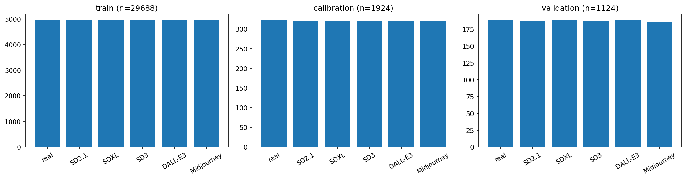
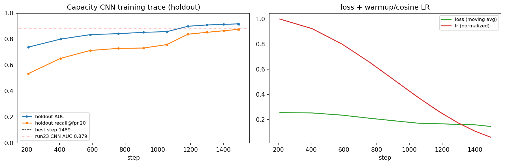
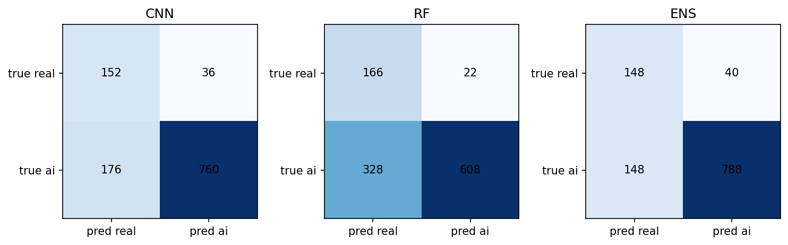
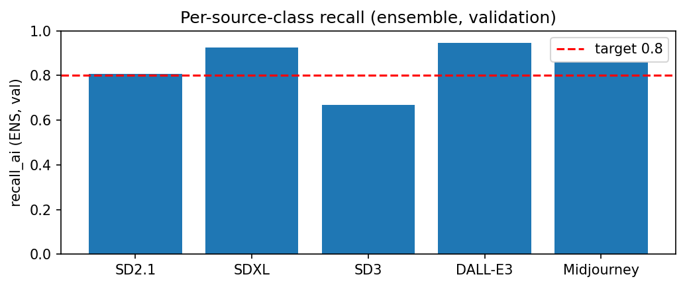
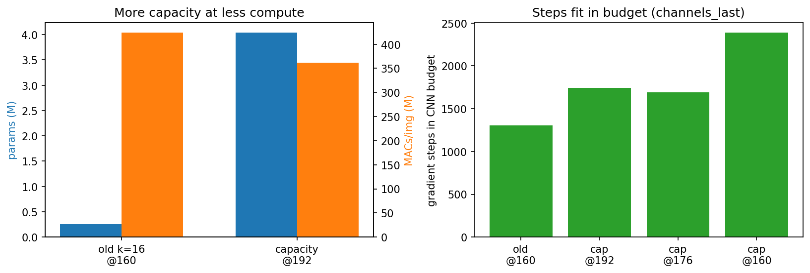

# AMLS 2026 Exercise — AI Image Detection — Report

Up to 8 pages, 10pt. Compile this to `report.pdf` for submission.

## Team

- Hannes Pohnke (469945)

---

## §1.1 Dataset Exploration & Cleaning (15 pts)

### Dataset overview

Train set: 29,688 images (7 parquet files); calibration: 1,924; validation: 1,124; predict: 100.
All images are JPEG-encoded RGB. No corrupt rows, no format variation, no missing labels were found.
The dataset is clean; the preprocessing steps below are motivated by label leakage, not data quality issues.

### Class distribution

Six source classes: 0=real, 1=SD 2.1, 2=SDXL, 3=SD 3, 4=DALL-E 3, 5=Midjourney. Classes 1-5 collapse to `ai_generated` for the binary task.
The binary split is consistent across all splits at ~83% AI / 17% real, with the six AI classes roughly balanced within the AI group.

### Image-size distribution and label leakage

Inspecting image dimensions across a 2,000-image train sample reveals a near-perfect class signal in image size alone:

| Class | Observed dimensions | Square? |
|---|---|---|
| real (0) | variable, median 640x480, range 320x201 to 640x640 | No |
| SD 2.1 (1) | exactly 320x320 | Yes |
| SDXL (2) | exactly 320x320 | Yes |
| SD 3 (3) | exactly 320x320 | Yes |
| DALL-E 3 (4) | exactly 270x270 | Yes |
| Midjourney (5) | exactly 320x320 | Yes |

Every AI image is square; real images are not. Aspect ratio alone (`width == height`) is a near-perfect binary classifier without looking at content. DALL-E 3 is further separable by its distinct 270 px size.

### Descriptive statistics

SD 3 is notably warmer and brighter than all other classes (mean red channel 0.560 vs 0.44-0.50 for others). SDXL has the lowest pixel standard deviation (0.191), consistent with its over-smoothed appearance. Neither metric cleanly separates real from AI in general. Original JPEG file size also correlates with class (real ~50 KB vs AI ~18-32 KB), but this reflects different compression settings per generator, not image content, and would not generalise to a holdout with re-encoded images. It is not used as a feature.

| Class | mean R | mean G | mean B | pixel std | file size (KB) |
|---|---|---|---|---|---|
| real | 0.463 | 0.450 | 0.421 | 0.247 | 49.6 |
| SD 2.1 | 0.486 | 0.466 | 0.425 | 0.225 | 31.7 |
| SDXL | 0.503 | 0.477 | 0.435 | 0.191 | 26.4 |
| SD 3 | 0.560 | 0.547 | 0.490 | 0.270 | 29.2 |
| DALL-E 3 | 0.482 | 0.452 | 0.410 | 0.251 | 17.7 |
| Midjourney | 0.445 | 0.429 | 0.385 | 0.223 | 23.8 |

*Table 1: per-class mean RGB, pixel std, and original JPEG file size (600-image sample from train).*

### Visual characteristics

Real photographs are casual snapshots with natural imperfections and no particular aesthetic intent.

**DALL-E 3**: most obviously AI at a glance. Images look plastic, animated, or illustrated with unnatural lighting and an uncanny rendered quality.

**SD 2.1**: more realistic lighting than DALL-E 3, but frequent structural and logical errors: wrong number of fingers, malformed faces, broken geometry in complex objects.

**SD 3**: similar character to SD 2.1, more realistic lighting, still frequently obvious due to logical errors in complex structures.

**SDXL**: fewer logical errors than earlier SD models, but images look heavily filtered: oversaturated, high contrast, artificial-feeling lighting.

**Midjourney**: hardest to detect. The best outputs look like high-quality camera photographs. The main tell is a cinematic "too perfect" quality that real casual photos rarely have. Does have outliers that are obviously stylised.

The most reliable detection cues, roughly in order: (1) logical errors in anatomy and geometry, (2) plastic/animated (most obvious in DALL-E 3), (3) overly polished, filmlike composition that no casual photographer produces.

### Deterministic cleaning pipeline

**Resize shorter-edge and center-crop to 224x224.** Image dimensions are a near-perfect class signal. Mapping all images to a fixed square canvas via aspect-preserving resize followed by center-crop removes both the square/non-square distinction and the 270 vs 320 px difference between generators. Stretching was rejected because it encodes the original aspect ratio in pixel coordinates. 224x224 matches the reference CNN in Appendix B.

**Convert to RGB.** Defensive: all images are already RGB, but this ensures consistent 3-channel input for any downstream model.

**Drop unreadable rows.** A 500-image smoke test found zero corrupt rows. The guard quantifies the drop rate on the full dataset and prevents training failures.

## §1.2 Modeling and Tuning under Time Constraints (35 pts)

We trained two model families and combined them into an ensemble: a classical Random
Forest on 101 engineered features and a five-layer convolutional network trained from
scratch on the cleaned images. The ensemble of both is the submitted pipeline.

### Training Setup

Before training, images are preprocessed once by `prepare.py`: each image is cleaned
(shorter-edge resize and center-crop to 224x224), stored as a uint8 memory-mapped
array, and 101 engineered features are extracted per image and saved alongside. This
step runs once and the outputs are reused by all subsequent scripts without re-reading
the raw data.

The training set (~29,700 images) is split into a fit set (90%) and a holdout set
(10%), stratified by source class. The task does not provide an explicit split for
model selection; the holdout is needed because CNN early stopping requires an
evaluation set, and using data/calibration/ for that purpose would contaminate the
threshold calibration step that happens after training. The holdout also drives RF vs.
LR selection and the ensemble alpha sweep. data/calibration/ is used exclusively for
threshold selection after all model parameters are fixed.

### Model Families

**Classical baseline.** We extract 101 features per image: RGB mean and standard
deviation (6), 8-bin per-channel histograms (24), Laplacian variance (1), Sobel edge
magnitude standard deviation (1), FFT high-frequency power ratio (1), four spectral
power band ratios (4), 3x3 spatial patch statistics (54), per-channel noise residual
standard deviation (3), channel skewness (3), chroma noise in Cb and Cr channels (2),
and JPEG block boundary discontinuity (2). We compared Logistic Regression (C in
{0.1, 1, 10}) and Random Forest (n_estimators in {200, 400}), selecting the winner by
holdout recall at each run. Random Forest with n=400 consistently won with holdout
recall 0.781 and AUC 0.885, compared to 0.749 and 0.857 for the best Logistic
Regression. The gap comes from non-linear interactions between features that Logistic
Regression cannot capture without further manual feature engineering.

**Neural model.** We built a five-layer convolutional network with batch normalization,
extending the Appendix B reference architecture to five convolutional layers followed
by a two-layer MLP head with dropout. Images are processed at 160px (shorter-edge
resize and center-crop, which removes the dimension leakage found in §1.1). Standard
3x3 convolutions preserve joint spatial and channel structure needed to detect
diffusion model artifacts. Training uses AdamW (lr=3e-4, weight_decay=1e-4), Focal
Loss with gamma=1.5 to downweight easy examples, and balanced class weights. The model
trains until a wall-clock deadline and saves the best checkpoint by holdout recall.

### Calibration Protocol

After training, the operating threshold is selected automatically using only
`data/calibration/`. The function `pick_threshold_for_fpr` finds the smallest threshold
t such that the empirical false-positive rate on calibration real-class images is at
most 0.19. We target 0.19 rather than the full 0.20 budget on purpose: it leaves a small
safety margin so the operating point still satisfies the 0.20 constraint when it
generalises to the unseen evaluation holdout, where the realised FPR can drift above the
calibration estimate. No validation data is used at any point during threshold selection. For the
ensemble, the CNN-to-RF weighting (alpha=0.40) is first selected by AUC sweep on a
held-out training fold, then `pick_threshold_for_fpr` is applied to the combined
ensemble scores on the calibration split.

### Ensemble

The ensemble combines scores as p = alpha * p\_cnn + (1 - alpha) * p\_rf with
alpha=0.40. On the validation set, CNN alone reaches recall=0.724 and RF alone reaches
recall=0.669, neither meeting the 0.80 target individually. The ensemble reaches 0.811
by combining complementary error patterns: the two models recover different subsets of
AI images, so combining them raises true positives without a proportional increase in
false positives. Holdout AUC rose from 0.877 (CNN alone) to 0.907 (ensemble). The CNN
detects spatial and frequency artifacts in pixel space while the Random Forest captures
file-level properties such as JPEG compression patterns and spectral distribution.

### Results

Table 2 reports the final ensemble on all evaluation splits. The model meets the target
of recall\_ai >= 0.80 while keeping fpr\_real <= 0.20 on the validation set.

| Model | Split | recall\_ai | fpr\_real | AUC |
|-------|-------|-----------|----------|-----|
| CNN | holdout | 0.724 | 0.135 | 0.879 |
| CNN | validation | 0.724 | 0.197 | 0.850 |
| CNN | validation\_augmented | 0.558 | 0.225 | 0.728 |
| RF | holdout | 0.680 | 0.101 | 0.885 |
| RF | validation | 0.669 | 0.128 | 0.854 |
| RF | validation\_augmented | 0.501 | 0.203 | 0.694 |
| Ensemble | holdout | 0.792 | 0.121 | 0.915 |
| Ensemble | validation | **0.811** | **0.170** | **0.888** |
| Ensemble | validation\_augmented | 0.604 | 0.289 | 0.734 |

*Threshold calibrated on data/calibration/ at target fpr=0.19 (thr=0.677, alpha=0.40).*

Figure 4 shows the training trace (holdout recall over gradient steps). Figure 5 shows
the confusion matrices for CNN, RF, and ensemble on the validation set. Figure 6 shows
per-source-class recall on the validation set: SDXL is the easiest class to detect
(0.95), SD3 is the hardest (0.63), with DALL-E3, Midjourney, and SD2.1 in between.

### Impact of Modeling Choices

Several design decisions had measurable impact on validation performance. Figure 7
summarises the ablation experiments.

**Image resolution.** Training at 224px produced only around 350 gradient steps within
the budget because larger images slow each step, leading to underfitting and AUC 0.848.
128px gave around 890 steps and produced a first passing run (run 7), but we continued
experimenting in search of a higher-performing configuration. 160px reaches around 930
steps at a moderate per-step cost and produced the best metrics across all development
runs (AUC 0.888, fpr=0.170 in run 23). We kept 160px.

**Focal loss gamma.** gamma=2.0 concentrated training on the hardest examples and
reached a single-run AUC of 0.896, but caused high variance across seeds, with recall
ranging from 0.740 to 0.827 across consecutive runs. gamma=1.5 trades a small amount
of peak performance for reproducible passes. We kept gamma=1.5.

**Architecture.** Residual connections and depthwise separable convolutions both
degraded performance relative to the plain five-conv baseline. For residual connections,
one possible explanation is that shallow skip connections add little when signals
already propagate well through five plain conv layers. For depthwise separable
convolutions, decoupling spatial and channel filtering may lose information about how
spatial patterns and color channels co-vary, which could matter here. Both were worse
in practice and we kept standard 3x3 convolutions.

**SD3 upweighting.** Giving SD3 samples extra loss weight pushed the false-positive
rate to 0.234-0.250 because the model became overly aggressive. Focal loss handles the
hard class without explicit upweighting.

### CPU Budget

Total training time for the submitted configuration: RF 18.4s + CNN 715.2s =
**733.6s = 4.71x the reference time**, within the 5x limit.

Several parameters were kept at standard values throughout: batch size (64),
convolutional filter size (3x3), and dropout rates. These are typically less sensitive
to tuning than architectural and loss choices at this dataset scale. A separate sweep
over learning rate, cosine annealing, and weight decay confirmed that lr=3e-4 with a
constant schedule was at or near optimal among the tested alternatives.

Running the submission script directly with timeout\_seconds=1800 allocates 1710s to
the CNN, roughly 2.5x the notebook budget. In one such run the model terminated after
1915 gradient steps via early stopping (patience=8 evals without improvement) and
produced ENS val=0.812, fpr=0.165, relatively consistent with the notebook results above.

### All Training Runs

Table 3 summarises all training runs conducted during development.

| Run | CNN arch | px | k | Gamma | ENS tgt | CNN val rec | CNN val fpr | ENS val rec | ENS val fpr | ENS AUC | Result |
|-----|----------|----|---|-------|---------|-------------|-------------|-------------|-------------|---------|--------|
| 1 | 3-conv | 96 | 16 | CE | - | 0.649 | 0.207 | - | - | - | no ENS |
| 2 | 3-conv | 128 | 16 | focal | - | 0.689 | 0.191 | - | - | - | no ENS |
| 3 | 4-conv | 128 | 16 | focal | - | 0.745 | 0.234 | - | - | - | no ENS |
| 4 | 4-conv | 128 | 16 | focal | 0.15 | 0.661 | 0.181 | 0.721 | 0.149 | - | FAIL |
| 5 | 4-conv | 128 | 16 | focal | 0.19 | 0.661 | 0.181 | 0.778 | 0.207 | - | FAIL |
| 6 | 4-conv | 128 | 16 | focal | 0.20 | 0.720 | 0.176 | 0.799 | 0.223 | - | FAIL |
| 7 | 5-conv | 128 | 16 | 1.5 | 0.19 | 0.674 | 0.138 | 0.809 | 0.197 | 0.884 | **PASS** |
| 8 | 5-conv | 128 | 16 | 1.5+sd3 | 0.19 | 0.755 | 0.186 | 0.833 | 0.234 | - | FAIL |
| 9 | 4-conv | 160 | 16 | 1.5+sd3 | 0.18 | 0.674 | 0.176 | 0.792 | 0.165 | - | FAIL |
| 10 | 5-conv | 128 | 16 | 1.5+sd3 | 0.18 | 0.709 | 0.186 | 0.775 | 0.176 | - | FAIL |
| 11 | 5-conv | 128 | 16 | 1.5+sd3 | 0.19 | 0.709 | 0.186 | 0.817 | 0.250 | - | FAIL |
| 12 | 5-conv | 128 | 16 | 1.5 | 0.19 | 0.761 | 0.218 | 0.803 | 0.191 | 0.891 | **PASS** |
| 13 | 5-conv | 128 | 16 | 2.0 | 0.19 | 0.779 | 0.223 | 0.827 | 0.207 | 0.896 | FAIL |
| 14 | 5-conv | 128 | 16 | 2.0 | 0.18 | 0.779 | 0.223 | 0.786 | 0.160 | - | FAIL |
| 15 | 5-conv | 128 | 16 | 2.0 | 0.185 | 0.743 | 0.213 | 0.771 | 0.165 | 0.885 | FAIL |
| 16 | ResBlock | 128 | 16 | 2.0 | 0.185 | 0.729 | 0.165 | 0.768 | 0.144 | 0.886 | FAIL |
| 17 | DW-sep | 128 | 32 | 2.0 | 0.185 | 0.723 | 0.213 | 0.740 | 0.149 | 0.875 | FAIL |
| 18 | 5-conv | 128 | 16 | 1.5 | 0.18 | 0.738 | 0.154 | 0.782 | 0.160 | 0.896 | FAIL |
| 19 | 5-conv | 224 | 16 | 1.5 | 0.18 | 0.669 | 0.186 | 0.772 | 0.144 | 0.878 | FAIL |
| 20 | 5-conv | 128 | 32 | 1.5 | 0.18 | 0.651 | 0.144 | 0.722 | 0.138 | 0.876 | FAIL |
| 21 | 5-conv | 160 | 16 | 1.5 | 0.18 | 0.746 | 0.207 | 0.795 | 0.176 | 0.878 | FAIL |
| 22 | 5-conv | 160 | 16 | 1.5 | 0.19 | 0.772 | 0.229 | 0.809 | 0.197 | 0.878 | **PASS** |
| 23 | 5-conv | 160 | 16 | 1.5 | 0.19 | 0.724 | 0.197 | 0.811 | 0.170 | 0.888 | **PASS** |

## §1.3 Data Augmentation & Feature Engineering (30 pts)

PDF §1.3 deliverables:

- [ ] Augmentation strategy and **why** these transforms (scale, JPEG compression,
      blur, etc.) reflect realistic distribution shift.
- [ ] Whether the model was trained from scratch or fine-tuned from
      `artifacts/task02/best.pt`.
- [ ] Comparison of Task 2 vs. Task 3 model on **both** `data/validation/` and
      `data/validation_augmented/` (same threshold-calibration protocol, same
      CPU budget).
- [ ] Target: recall_ai >= 0.6 on `data/validation_augmented/` with FPR <= 0.20.

## §1.4 Explainability (20 pts)

PDF §1.4 deliverables:

- [ ] Method choice and rationale — saliency maps, occlusion / perturbation,
      FP/FN inspection, real-vs-AI attention comparison.
- [ ] Visual or quantitative examples.
- [ ] **Critical discussion** — are the explanations plausible? Do they reveal
      shortcut features or dataset bias?
- [ ] Code lives in [task04_explainability/](../task04_explainability/).

---

## Appendix — Submission checklist

- [ ] `solution/Dockerfile` builds an image <= 4 GB
- [ ] No internet at runtime (`--network none` works)
- [ ] `python clean.py --timeout_seconds 600` runs to completion
- [ ] `python prepare.py --timeout_seconds 600` runs (does NOT touch `data/predict/`)
- [ ] `python train.py --timeout_seconds 1800` writes `artifacts/task02/best.pt`
- [ ] `python predict.py --timeout_seconds 600` writes `artifacts/task02/predictions.csv`
- [ ] `python train_augmented.py --timeout_seconds 1800` writes `artifacts/task03/best.pt`
- [ ] `python predict_augmented.py --timeout_seconds 600` writes `artifacts/task03/predictions.csv`
- [ ] Final `AMLS_Exercise_<student_ID>.zip` is <= 20 MB and **excludes** the
      built image, `solution/data/`, `solution/artifacts/`.
